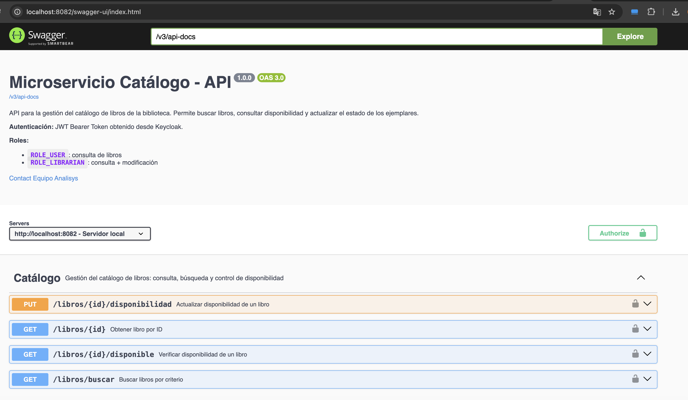
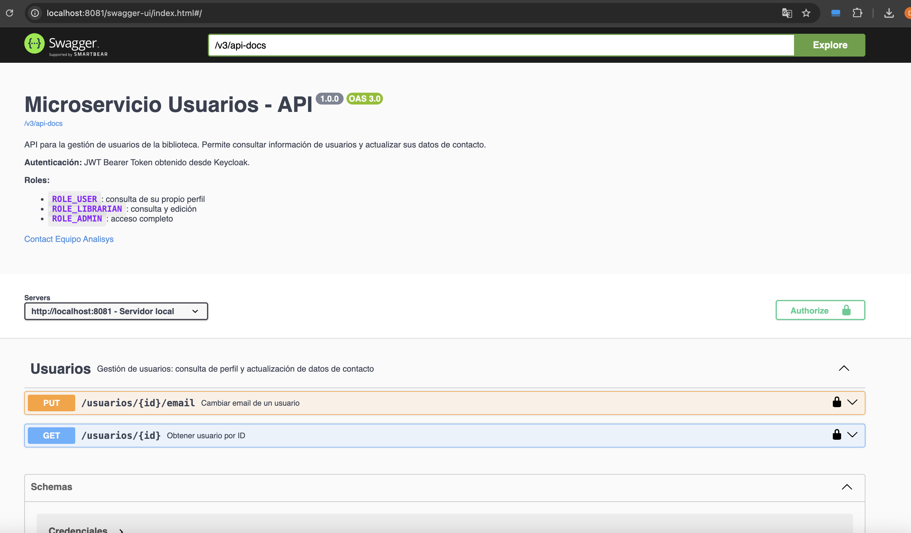
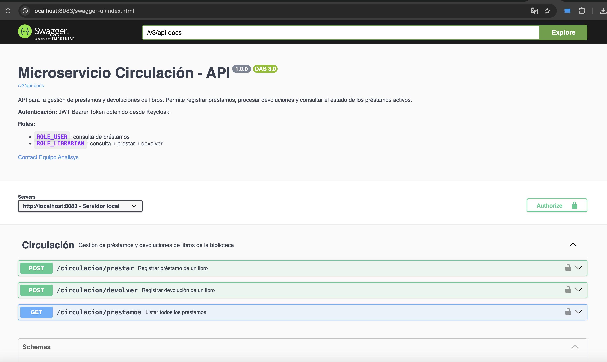
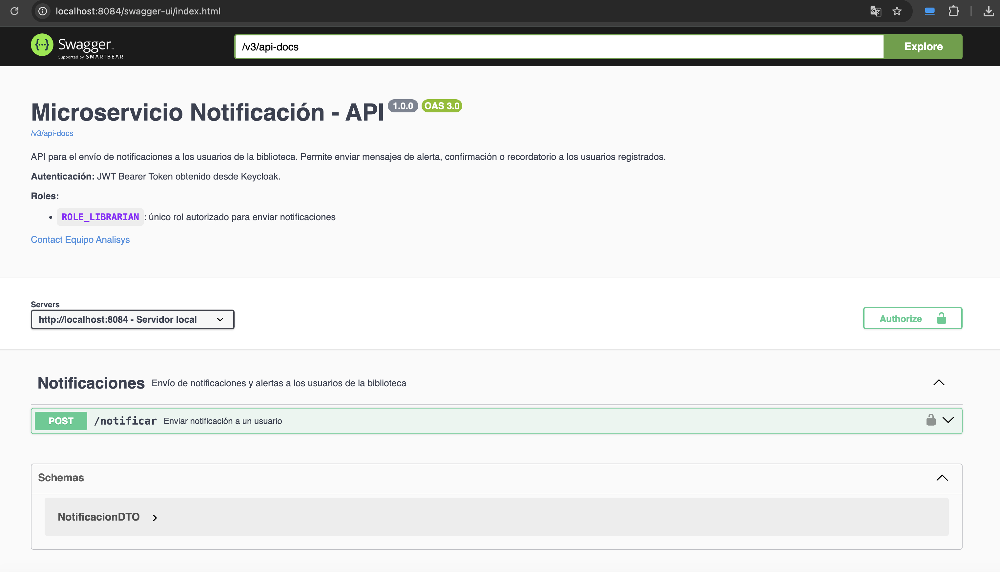
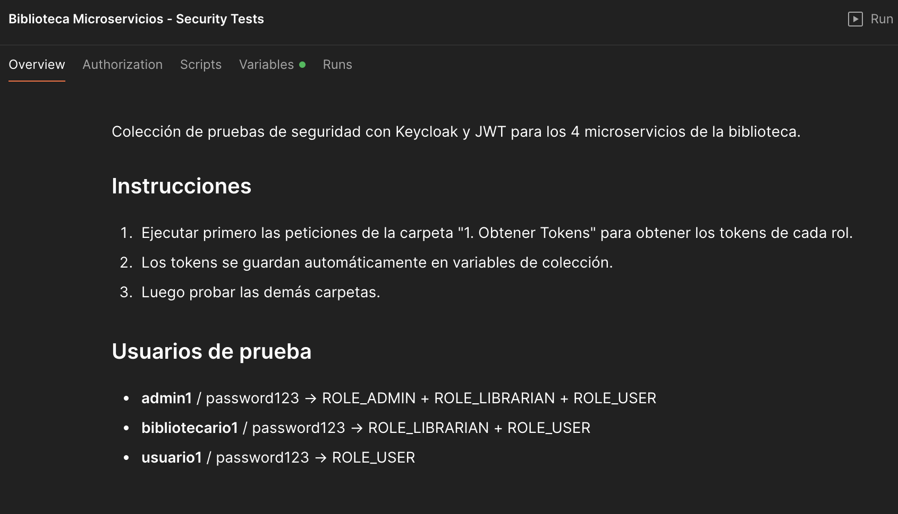
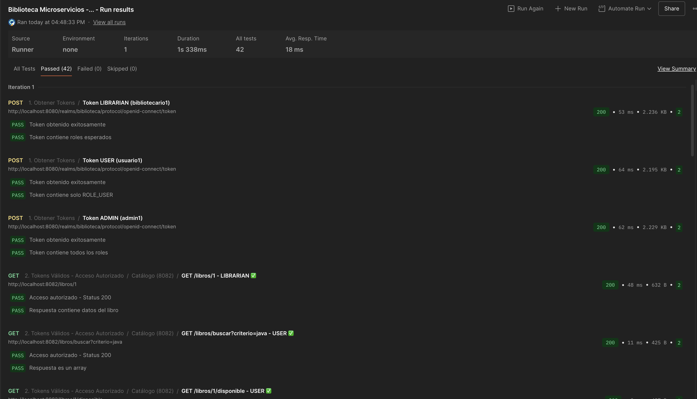

# 📚 Sistema de Biblioteca — Microservicios con Spring Boot + Keycloak

Sistema de gestión de biblioteca implementado como arquitectura de microservicios, con seguridad basada en **JWT/OAuth2** mediante **Keycloak**, documentación interactiva con **Swagger/OpenAPI** y colección de pruebas en **Postman**.

---

## 🏗️ Arquitectura General

```
                          ┌─────────────────┐
                          │   Keycloak 26.5  │
                          │  :8080  (IdP)    │
                          └────────┬─────────┘
                                   │ JWT
          ┌──────────────┬─────────┼──────────────┐
          │              │         │              │
   ┌──────┴──────┐ ┌─────┴────┐ ┌─┴───────┐ ┌───┴──────────┐
   │  Usuarios   │ │ Catálogo │ │Circulac.│ │ Notificación │
   │   :8081     │ │  :8082   │ │  :8083  │ │    :8084     │
   └─────────────┘ └──────────┘ └─────────┘ └──────────────┘
```

| Microservicio             | Puerto | Base de datos | Descripción                          |
|---------------------------|--------|---------------|--------------------------------------|
| `microservicio-usuarios`  | 8081   | H2 in-memory  | Gestión de usuarios de la biblioteca |
| `microservicio-catalogo`  | 8082   | H2 in-memory  | Catálogo de libros y disponibilidad  |
| `microservicio-circulacion` | 8083 | H2 in-memory  | Préstamos y devoluciones             |
| `microservicio-notificacion` | 8084 | H2 in-memory | Envío de notificaciones              |
| Keycloak                  | 8080   | Volume Docker | Servidor de autenticación/autorización |

---

## 🔐 Seguridad con Keycloak

### Realm: `biblioteca`

| Rol               | Permisos                                                         |
|-------------------|------------------------------------------------------------------|
| `ROLE_ADMIN`      | Acceso completo a todos los recursos                             |
| `ROLE_LIBRARIAN`  | Préstamos, devoluciones, actualizar disponibilidad de libros     |
| `ROLE_USER`       | Consultar libros, ver préstamos, consultar su propio perfil      |

### Usuarios precargados en Keycloak

| Usuario         | Contraseña  | Rol               |
|-----------------|-------------|-------------------|
| `admin1`        | `admin123`  | `ROLE_ADMIN`      |
| `bibliotecario1`| `biblio123` | `ROLE_LIBRARIAN`  |
| `usuario1`      | `user123`   | `ROLE_USER`       |

### Clientes OAuth2 configurados

- **`microservicio-usuarios`** — client secret en `application.properties`
- **`microservicio-catalogo`** — client secret en `application.properties`
- **`microservicio-circulacion`** — client secret en `application.properties`
- **`microservicio-notificacion`** — client secret en `application.properties`

---

## 🚀 Cómo correr el proyecto

### 1. Requisitos previos

- **Java 17+**
- **Maven 3.8+** (o usar el wrapper `./mvnw` incluido)
- **Docker** con Docker Desktop corriendo

### 2. Iniciar Keycloak

```bash
docker run -d --name keycloak-biblioteca -p 8080:8080 \
  -e KC_BOOTSTRAP_ADMIN_USERNAME=admin \
  -e KC_BOOTSTRAP_ADMIN_PASSWORD=admin \
  -v keycloak_data:/opt/keycloak/data \
  -v "$(pwd)/keycloak:/opt/keycloak/data/import" \
  quay.io/keycloak/keycloak:26.5.4 start-dev --import-realm
```

> El flag `--import-realm` importa automáticamente `keycloak/biblioteca-realm.json` y `keycloak/biblioteca-users-0.json` al arrancar.

**Verificar que Keycloak esté listo:**
```bash
curl http://localhost:8080/realms/biblioteca
# Debe responder con JSON que incluye "realm": "biblioteca"
```

### 3. Iniciar los microservicios

Abre una terminal por cada microservicio (o usa `&` para ejecutar en background):

**Usuarios (puerto 8081):**
```bash
cd microservicio-usuarios
./mvnw spring-boot:run
```

**Catálogo (puerto 8082):**
```bash
cd microservicio-catalogo
./mvnw spring-boot:run
```

**Circulación (puerto 8083):**
```bash
cd microservicio-circulacion
./mvnw spring-boot:run
```

**Notificación (puerto 8084):**
```bash
cd microservicio-notificacion
./mvnw spring-boot:run
```

**Verificar que todos estén corriendo:**
```bash
for port in 8081 8082 8083 8084; do
  echo "Puerto $port: $(curl -s -o /dev/null -w '%{http_code}' http://localhost:$port/swagger-ui/index.html)"
done
# Debe retornar 200 en todos
```

---

## 📋 Endpoints por Microservicio

### Microservicio Usuarios — `http://localhost:8081`

| Método | Ruta                  | Rol requerido                 | Descripción                    |
|--------|-----------------------|-------------------------------|--------------------------------|
| `GET`  | `/usuarios/{id}`      | `ROLE_USER`, `ROLE_LIBRARIAN` | Obtener datos de un usuario    |
| `PUT`  | `/usuarios/{id}/email`| `ROLE_USER`, `ROLE_LIBRARIAN` | Actualizar email de un usuario |

### Microservicio Catálogo — `http://localhost:8082`

| Método | Ruta                          | Rol requerido                 | Descripción                         |
|--------|-------------------------------|-------------------------------|-------------------------------------|
| `GET`  | `/libros/{id}`                | `ROLE_USER`, `ROLE_LIBRARIAN` | Obtener detalles de un libro        |
| `GET`  | `/libros/{id}/disponible`     | `ROLE_USER`, `ROLE_LIBRARIAN` | Verificar disponibilidad del libro  |
| `PUT`  | `/libros/{id}/disponibilidad` | `ROLE_LIBRARIAN`              | Actualizar disponibilidad del libro |
| `GET`  | `/libros/buscar`              | `ROLE_USER`, `ROLE_LIBRARIAN` | Buscar libros por criterio          |

### Microservicio Circulación — `http://localhost:8083`

| Método | Ruta                  | Rol requerido    | Descripción                              |
|--------|-----------------------|------------------|------------------------------------------|
| `POST` | `/circulacion/prestar`  | `ROLE_LIBRARIAN` | Registrar préstamo de un libro         |
| `POST` | `/circulacion/devolver` | `ROLE_LIBRARIAN` | Registrar devolución de un préstamo    |
| `GET`  | `/circulacion/prestamos`| `ROLE_USER`, `ROLE_LIBRARIAN` | Listar todos los préstamos |

### Microservicio Notificación — `http://localhost:8084`

| Método | Ruta                   | Rol requerido    | Descripción                          |
|--------|------------------------|------------------|--------------------------------------|
| `POST` | `/notificaciones/notificar` | `ROLE_LIBRARIAN` | Enviar notificación a un usuario |

---

## 📖 Documentación Swagger/OpenAPI

Cada microservicio expone su documentación interactiva en `/swagger-ui/index.html` (accesible **sin autenticación**):

| Microservicio | URL Swagger UI                                        |
|---------------|-------------------------------------------------------|
| Usuarios      | http://localhost:8081/swagger-ui/index.html           |
| Catálogo      | http://localhost:8082/swagger-ui/index.html           |
| Circulación   | http://localhost:8083/swagger-ui/index.html           |
| Notificación  | http://localhost:8084/swagger-ui/index.html           |

La documentación OpenAPI en formato JSON está disponible en:
- `http://localhost:{puerto}/v3/api-docs`

### Capturas de pantalla — Swagger UI

**Microservicio Catálogo**


**Microservicio Usuarios**


**Microservicio Circulación**


**Microservicio Notificación**


---

## 🧪 Pruebas con Postman

La colección incluye pruebas automatizadas para todos los endpoints con flujo de autenticación incluido.

### Archivos

| Archivo | Descripción |
|---------|-------------|
| `postman/Biblioteca-Microservicios-Security.postman_collection.json` | Colección completa con 42 tests |

### Importar y ejecutar

1. Abrir **Postman**
2. **Import** → seleccionar `postman/Biblioteca-Microservicios-Security.postman_collection.json`
3. La colección automáticamente:
   - Solicita un token JWT a Keycloak según el rol necesario
   - Inyecta el token `Bearer` en cada request
   - Valida los códigos de respuesta HTTP esperados
4. Click **Run collection** para ejecutar todas las pruebas

### Capturas de pantalla — Postman

**Vista de la colección importada**


**Resultados de la ejecución**


---

## 🗂️ Estructura del Proyecto

```
microBiblio/
├── microservicio-usuarios/          # Puerto 8081
│   └── src/main/java/co/analisys/biblioteca/
│       ├── config/
│       │   ├── SecurityConfig.java  # JWT + OAuth2 Resource Server
│       │   └── OpenApiConfig.java   # Swagger/OpenAPI config
│       ├── controller/UsuarioController.java
│       ├── model/
│       └── service/
├── microservicio-catalogo/          # Puerto 8082
│   └── src/main/java/co/analisys/biblioteca/
│       ├── config/
│       │   ├── SecurityConfig.java
│       │   └── OpenApiConfig.java
│       ├── controller/CatalogoController.java
│       ├── model/
│       └── service/
├── microservicio-circulacion/       # Puerto 8083
│   └── src/main/java/co/analisys/biblioteca/
│       ├── config/
│       │   ├── SecurityConfig.java
│       │   └── OpenApiConfig.java
│       ├── controller/CirculacionController.java
│       ├── model/
│       └── service/
├── microservicio-notificacion/      # Puerto 8084
│   └── src/main/java/co/analisys/biblioteca/
│       ├── config/
│       │   ├── SecurityConfig.java
│       │   └── OpenApiConfig.java
│       ├── controller/NotificacionController.java
│       ├── model/
│       └── service/
├── keycloak/
│   ├── biblioteca-realm.json        # Configuración del realm (exportado)
│   └── biblioteca-users-0.json     # Usuarios con credenciales (exportado)
├── postman/
│   ├── Biblioteca-Microservicios-Security.postman_collection.json
│   ├── postman-collection.png
│   └── postman-run.png
├── swagger/
│   ├── catalogo-swagger.png
│   ├── circulacion-swagger.png
│   ├── notificacion-swagger.png
│   └── usuarios-swagger.png
└── README.md
```

---

## ⚙️ Tecnologías Utilizadas

| Tecnología | Versión | Uso |
|-----------|---------|-----|
| Java | 17 | Lenguaje principal |
| Spring Boot | 3.3.2 | Framework del microservicio |
| Spring Security | 6.x | Seguridad y validación JWT |
| Spring OAuth2 Resource Server | 6.x | Validación de tokens Keycloak |
| Keycloak | 26.5.4 | Servidor de identidad y autorización (IdP) |
| springdoc-openapi | 2.6.0 | Generación de Swagger UI y OpenAPI 3 |
| H2 Database | — | Base de datos en memoria (desarrollo) |
| Docker | — | Contenedor para Keycloak |

---

## 🔑 Obtener un Token JWT manualmente

```bash
# Obtener token como bibliotecario1
curl -s -X POST http://localhost:8080/realms/biblioteca/protocol/openid-connect/token \
  -H "Content-Type: application/x-www-form-urlencoded" \
  -d "grant_type=password" \
  -d "client_id=microservicio-catalogo" \
  -d "client_secret=<client_secret>" \
  -d "username=bibliotecario1" \
  -d "password=biblio123" | python3 -m json.tool
```

```bash
# Usar el token en un request
TOKEN="<access_token_del_paso_anterior>"

curl -H "Authorization: Bearer $TOKEN" \
  http://localhost:8082/libros/1
```

---

## 🛑 Detener el proyecto

```bash
# Detener los microservicios (Ctrl+C en cada terminal, o)
lsof -ti:8081,8082,8083,8084 | xargs kill -9

# Detener Keycloak
docker stop keycloak-biblioteca

# (Opcional) Eliminar el contenedor manteniendo los datos en el volumen
docker rm keycloak-biblioteca
```

> **Nota:** Los datos de Keycloak persisten en el volumen Docker `keycloak_data`. Para un reset completo: `docker volume rm keycloak_data`
